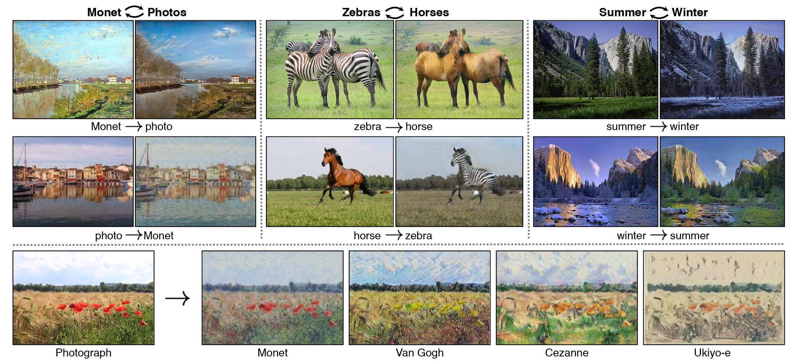
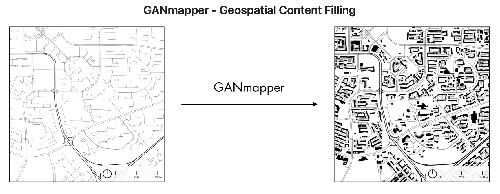

# Traditional Generative ML

**Related API:** [`ccai9012.gan_utils`](../../html/api/ccai9012/gan_utils.html)

### Overview
**Category:** Synthetic Data Generation & Prediction

**Modular Components:**
- CycleGAN Training Pipeline
- Custom Dataset Loader
- Image Augmentation
- Text2Image Prompt Interface

   
  <em>Zhu, J.-Y., Park, T., Isola, P., Efros, A.A., 2020. Unpaired Image-to-Image Translation using Cycle-Consistent Adversarial Networks. https://doi.org/10.48550/arXiv.1703.10593
</em>

### Use Cases
- Predicting dockless bike-sharing demand based on satellite image
- Riding activity heatmap generation with urban map
- Solar radiation prediction at the urban-scale

### Code Example: Building Profile Layout Generation from Road Network

   
  <em>Wu, A.N., Biljecki, F., 2021. GANmapper: geographical data translation [WWW Document]. arXiv.org. https://doi.org/10.1080/13658816.2022.2041643
</em>

**Content:**
- Use Pix2Pix style GAN model to generate building profile layout from road network
- Illustrate the whole pipeline of GAN, including data processing, training, inference and evaluate
- Data augmentation to deal with insufficient data volume

**Dataset:**
- Building profile and road network dataset (image pair)
- Source: https://github.com/ualsg/GANmapper

**Required Packages:** PyTorch, torchvision, CycleGAN, Pillow, matplotlib

---
