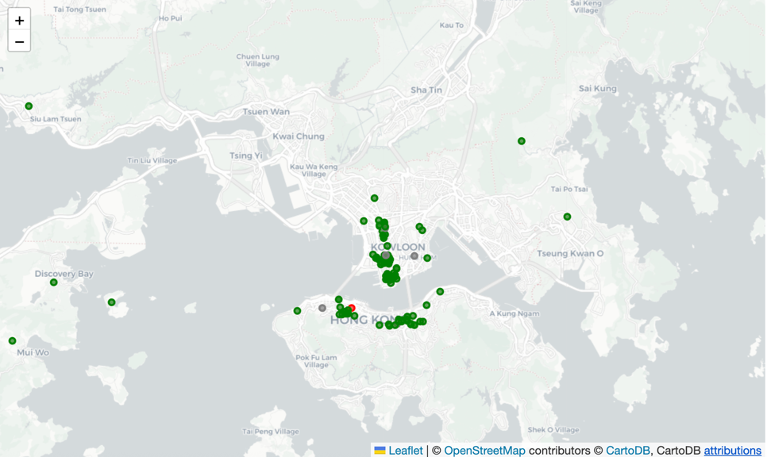
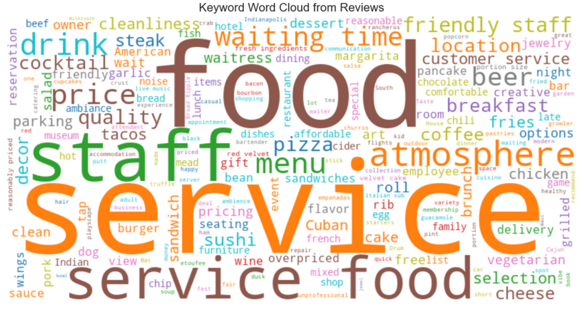

# LLM for Structuring Information

**Related API:** [`ccai9012.llm_utils`](../../html/api/ccai9012/llm_utils.html) · [`ccai9012.viz_utils`](../../html/api/ccai9012/viz_utils.html)

### Overview
**Category:** Unstructured Text Analysis & Knowledge Structuring

**Modular Components:**
- Text Preprocessing Pipeline
- LLM API Calling
- LLM Embedding Extractor
- Vector Clustering
- Q&A over Documents
- Heatmap Visualization
- Wordcloud generation

### Use Cases
- How do short-term rental reviews reflect neighborhood livability over time?
- Can we detect major sentiment shifts before and after a major policy announcement or public event?
- How is generative AI affecting job market? (Job market analysis across industry and time)
- Can we use LLMs to detect gaps between declared policy priorities and proposed implementation measures in urban planning documents?
- How are terms like "resilience", "sustainability", or "equity" defined and operationalized differently across documents?

### Code Examples

#### Urban Sentiment Classification
**Content:**
- Extract structured sentiment (location, themes, polarity) from reviews using LLM
- Use NER + classification
- Create sentiment maps to inform urban design

**Dataset:**
- Yelp open dataset
- Source: https://business.yelp.com/data/resources/open-dataset/ (Please press the **Download JSON** red button to get the dataset, and put the file under `starter_kits/2_llm_structure_output/urban_sentiment/data` folder.)

**Required Packages:** LangChain, DeepSeek, transformers, pandas, json

   
  <em>Yelp Review heatmap.</em>

#### Airbnb Reviews Analysis
**Content:**
- Collect Airbnb housing and review data (public dataset Inside Airbnb)
- Classification of reviews' sentiments of different aspects (location, host, facility)
- Create Airbnb aspect-wise impression heatmap and wordcloud

**Dataset:**
- Airbnb review dataset
- Source: https://insideairbnb.com/get-the-data/

   
  <em>Airbnb Review keywords wordcloud.</em>

#### Energy Action Plan PDF Structuring
**Content:**
- Extract building/energy info from Energy Action Plans (PDFs)
- Summarize content into JSON format for analysis
- Enable comparison across tribal regions over time

**Dataset:**
- Energy Action Plans documents
- Source: https://cchrc.org/

**Required Packages:** LangChain, PyMuPDF, pdfplumber, transformers, pandas

#### Literature Review of Topics
**Content:**
- Webcrawl website for relevant papers
- Go through document by document with specific questions
- Identify insights & keywords
- Catalogue & represent findings

**Dataset:** Collection of literatures from specific topic

---
