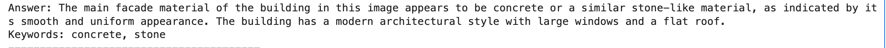
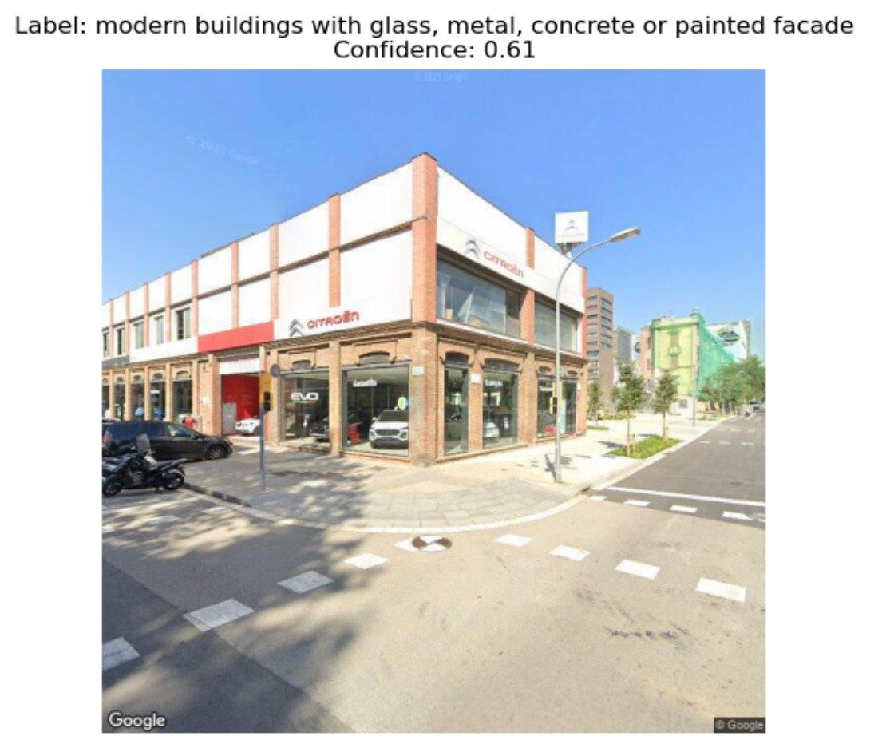
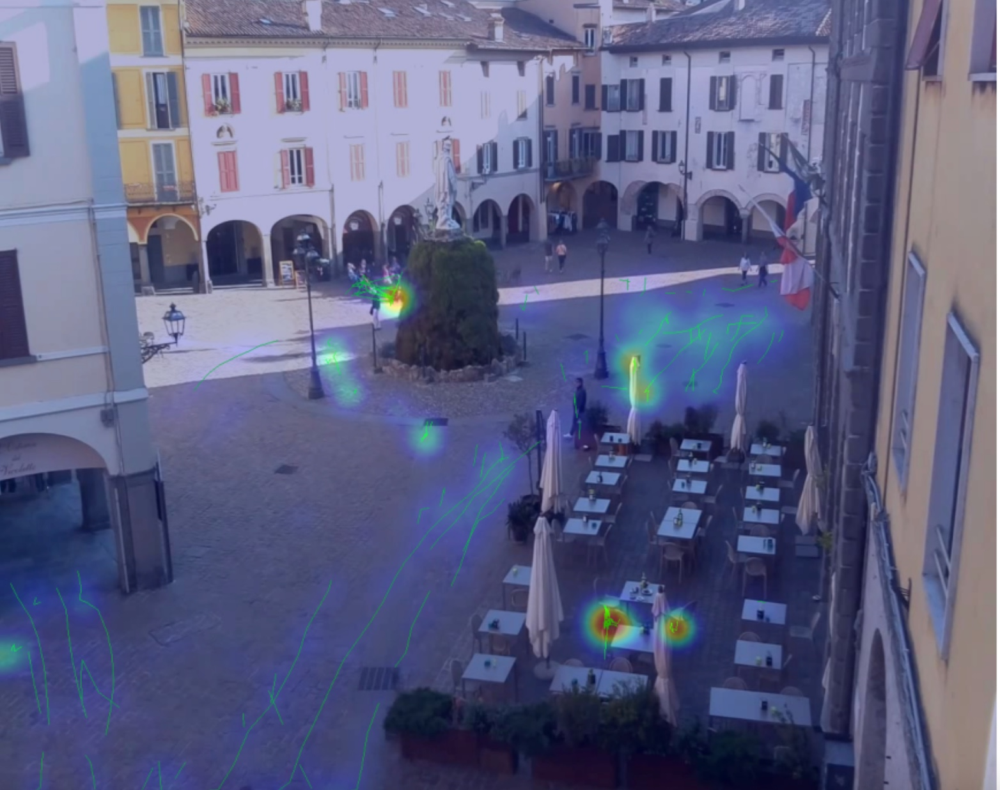
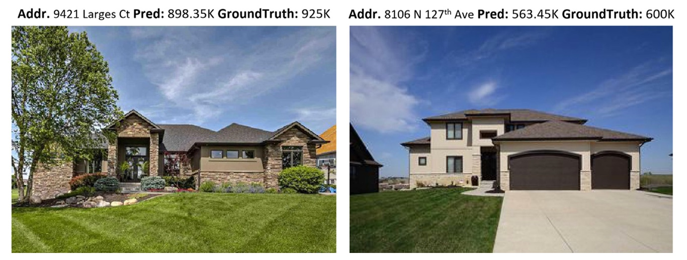

# Starter Kits Documentation

This document provides detailed information about all five starter kit modules available for your final projects. Each module includes comprehensive components, example use cases, and required packages.

## Module 1: Traditional Generative ML

**Related API:** [`ccai9012.gan_utils`](api/gan_utils.html)

### Overview
**Category:** Synthetic Data Generation & Prediction

**Modular Components:**
- CycleGAN Training Pipeline
- Custom Dataset Loader
- Image Augmentation
- Text2Image Prompt Interface

   
  <em>Zhu, J.-Y., Park, T., Isola, P., Efros, A.A., 2020. Unpaired Image-to-Image Translation using Cycle-Consistent Adversarial Networks. https://doi.org/10.48550/arXiv.1703.10593
</em>

### Use Cases
- Predicting dockless bike-sharing demand based on satellite image
- Riding activity heatmap generation with urban map
- Solar radiation prediction at the urban-scale

### Code Example: Building Profile Layout Generation from Road Network

   
  <em>Wu, A.N., Biljecki, F., 2021. GANmapper: geographical data translation [WWW Document]. arXiv.org. https://doi.org/10.1080/13658816.2022.2041643
</em>

**Content:**
- Use Pix2Pix style GAN model to generate building profile layout from road network
- Illustrate the whole pipeline of GAN, including data processing, training, inference and evaluate
- Data augmentation to deal with insufficient data volume

**Dataset:**
- Building profile and road network dataset (image pair)
- Source: https://github.com/ualsg/GANmapper

**Required Packages:** PyTorch, torchvision, CycleGAN, Pillow, matplotlib

---

## Module 2: LLM for Structuring Information

**Related API:** [`ccai9012.llm_utils`](api/llm_utils.html)

### Overview
**Category:** Unstructured Text Analysis & Knowledge Structuring

**Modular Components:**
- Text Preprocessing Pipeline
- LLM API Calling
- LLM Embedding Extractor
- Vector Clustering
- Q&A over Documents
- Heatmap Visualization
- Wordcloud generation

### Use Cases
- How do short-term rental reviews reflect neighborhood livability over time?
- Can we detect major sentiment shifts before and after a major policy announcement or public event?
- How is generative AI affecting job market? (Job market analysis across industry and time)
- Can we use LLMs to detect gaps between declared policy priorities and proposed implementation measures in urban planning documents?
- How are terms like "resilience", "sustainability", or "equity" defined and operationalized differently across documents?

### Code Examples

#### Urban Sentiment Classification
**Content:**
- Extract structured sentiment (location, themes, polarity) from reviews using LLM
- Use NER + classification
- Create sentiment maps to inform urban design

**Dataset:**
- Yelp open dataset
- Source: https://business.yelp.com/data/resources/open-dataset/

**Required Packages:** LangChain, DeepSeek, transformers, pandas, json

   
  <em>Yelp Review heatmap.</em>

#### Airbnb Reviews Analysis
**Content:**
- Collect Airbnb housing and review data (public dataset Inside Airbnb)
- Classification of reviews' sentiments of different aspects (location, host, facility)
- Create Airbnb aspect-wise impression heatmap and wordcloud

**Dataset:**
- Airbnb review dataset
- Source: https://insideairbnb.com/get-the-data/

   
  <em>Airbnb Review keywords wordcloud.</em>

#### Energy Action Plan PDF Structuring
**Content:**
- Extract building/energy info from Energy Action Plans (PDFs)
- Summarize content into JSON format for analysis
- Enable comparison across tribal regions over time

**Dataset:**
- Energy Action Plans documents
- Source: https://cchrc.org/

**Required Packages:** LangChain, PyMuPDF, pdfplumber, transformers, pandas

#### Literature Review of Topics
**Content:**
- Webcrawl website for relevant papers
- Go through document by document with specific questions
- Identify insights & keywords
- Catalogue & represent findings

**Dataset:** Collection of literatures from specific topic

---

## Module 3: Multimodal Reasoning

**Related API:** [`ccai9012.multi_modal_utils`](api/multi_modal_utils.html) · [`ccai9012.svi_utils`](api/svi_utils.html)

### Overview
**Category:** Visual-Language Reasoning

**Modular Components:**
- Model Initialization (API calling/Local implementation)
- Image Captioning
- Keyword Extraction from Text

### Use Cases
- Do AI models associate certain architectural styles with particular geographic regions unfairly?
- Urban light pollution areas spotting based on facade material analysis
- Can we visualize gentrification through facade transformation using historical vs. recent street views?
- Thermal defect spotting based on facade and indoor infrared images

### Code Examples

#### Material Bias in AI-generated Architectural Images
**Content:**
- Use Text2Image to generate images of buildings
- Generate lots of images
- Parse images

   
   
  <em>Using BLIP to identify the facade material from the images generated from StableDiffusion.</em>

#### Assessment of Conservation Status in Urban Historic Districts
**Content:**
- Categorizing SVIs of historic districts with CLIP
- Evaluating mixing index of historic and added-on buildings

**Dataset:**
- Google Street View Imagery (SVI)
- Source: Google Map API
- 

   
  <em>Using CLIP to identify the historical status of the urban block.</em>

---

## Module 4: CV Models (Segmentation, Detection, Tracking)

**Related API:** [`ccai9012.yolo_utils`](api/yolo_utils.html) · [`ccai9012.svi_utils`](api/svi_utils.html)

### Overview
**Category:** Perception & Prediction from Visual Data

**Modular Components:**
- Object Detection/Tracking with YOLO
- Semantic Segmentation Model
- Trajectory Extraction
- Visualization

### Use Cases
- What factors influence walking behavior?
- How does visual cleanliness (graffiti, trash, lighting) relate to perceived safety?
- Can we predict CO2 emission using the SVIs?

### Code Examples

#### Pedestrian Behavior Analysis in Public Spaces
**Content:**
- Detect pedestrians using YOLO
- Track movement using DeepSORT
- Analyze flow, dwell time, and walkability

**Dataset:**
- Webcam data
- Source: https://www.skylinewebcams.com/en.html

**Required Packages:** YOLOv5, OpenCV, DeepSORT, numpy, matplotlib

   
  <em>Identify pedestrian location and generate footprint heatmap with tracking.</em>

#### SVI-Based Housing Price Prediction
**Content:**
- Use subjective perception scores (e.g., cleanliness, greenery) on SVI
- Combine CV scoring with regression to predict housing price
- Visual quality → real estate value linkage

**Datasets:**
- Google Street View Imagery (SVI) from Google Map API
- California housing price dataset from sklearn.datasets

**Required Packages:** OpenCV, scikit-learn, pandas, matplotlib, PyTorch

   
  <em>SVI-based housing price estimation. Nouriani, A., Lemke, L., 2022. Vision-based housing price estimation using interior, exterior & satellite images. Intelligent Systems with Applications 14, 200081. https://doi.org/10.1016/j.iswa.2022.200081.</em>

---

## Module 5: Bias Detection & Interpretability

**Related API:** [`ccai9012.nn_utils`](api/nn_utils.html)

### Overview
**Category:** Bias Detection

**Modular Components:**
- Fairness Metrics Evaluator
- Model Explainer (SHAP/LIME)
- Feature Attribution Visualizer

### Use Cases
- Do public service recommendation models (e.g., bus stop placement, streetlight allocation) tend to ignore low-density or low-income areas?
- Why citizens' application for housing subsidies or public services was deprioritized?
- Do predictive maintenance systems for infrastructure (e.g., water leaks, power outages) prioritize certain zones? Is this optimization fair?
- In citizen feedback systems (e.g., 311 complaints), are certain types of reports more likely to trigger response recommendations than others? Why?

### Code Example: Credit Decision Bias Auditing
**Content:**
- Analyze credit data using LLM and interpretable ML
- Detect bias in approval logic (e.g., income, gender)
- Apply SHAP and counterfactual fairness methods

**Datasets:**
- German Dataset (credit data) from AIF Fairness 360
- COMPAS dataset (pre-prepared from https://www.kaggle.com/datasets/danofer/compass)

**Required Packages:** Fairlearn, SHAP, pandas, scikit-learn, transformers

---

## Getting Started

1. **Choose your module** based on your interests and project goals
2. **Review the use cases** to understand potential applications
3. **Check the required packages** and install them in your environment
4. **Access the starter code** in the corresponding `starter_kits/` directory
5. **Download the datasets** from the provided sources
6. **Follow the code examples** to understand the implementation approach

For technical support and detailed API documentation, refer to the main [README.md](../README.md) and the [ccai9012 library documentation](ccai9012/index.html).
